# 程序员修炼之道-从小工到专家

## 目录

### 第一章 注重实效的哲学
### 第二章 注重实效的途径
### 第三章 基本工具
### 第四章 注重实效的偏执
### 第五章 弯曲，或曲折
### 第六章 当你编码时
### 第七章 在项目开始之前
### 第八章 注重实效的项目

## 注重实效的程序员之快速参考指南

* 关心你的技艺

*  思考！你的工作

*  提供各种选择，不要找蹩脚的借口

*  不要容忍破窗户

*  做变化的催化剂

*  记住大图景

*  使质量成为需求

*  定期为你的知识资产投资

*  批判的分析你读到的和听到的

*  你说什么和你怎么说同样重要

*  不要重复你自己

*  让复用变得容易

*  消除无关事物之间的影响

*  不存在最终决策

*  用曳光弹找到目标

*  为了学习而制作原型

*  靠近问题领域编程

*  估算，以避免发生意外

*  通过代码对进度表进行迭代

*  用纯文本保存知识

*  利用命令shell的力量

*  用好一种编辑器

*  总是使用源码控制

*  不要恐慌

*  "Select"没有问题

*  不要假定，要证明

*  学习一种文本操纵语言

*  编写能编写代码的代码

*  你不可能写出完美的软件

*  早崩溃

*  用断言避免不可能发生的事情

*  将异常用于异常的问题

*  要有始有终

*  使模块之间的耦合降低到最少

*  要配置，不要集成

*  将抽象放进代码，细节放进元数据

*  分析工作流，以改善并发性

*  用服务进行设计

*  总是为并发进行设计

*  使视图与模型分离

*  用黑板协调工作流

*  不要靠巧合编程

*  估算你的算法的阶

*  测试你的估算

*  早重构，常重构

*  测试你的软件，否则你的用户就得到测试

*  不要使用你不理解的向导代码

*  不要搜集需求，挖掘它们

*  与用户一同工作，以像用户一样思考

*  抽象比细节活得更长久

*  使用项目词汇表

*  不要再盒子外面思考-要找到盒子

*  等你准备好再开始

*  对有些事情"做"胜于"描述"

*  不要做形式方法的奴隶

*  昂贵的工具不一定能制作出更好的设计

*  围绕功能组织团队

*  不要使用手工流程

*  早测试，常测试，自动测试

*  要到通过全部测试，编码才算完成

*  通过"蓄意破坏"测试你的测试

*  测试状态覆盖，而不是代码覆盖

*  一个bug只抓一次

*  英语就是一种编程语言

*  把文档建在里面，不要拴在外面

*  温和的超出用户预期

*  在你的作品上签名

### 第七章 在项目开始之前

`解开不可能解开的谜题` 

::: tip Don't Think Outside the Box - Find the Box
不要在盒子外面思考，要找到盒子。
:::

`[思考·四柱谜题]`

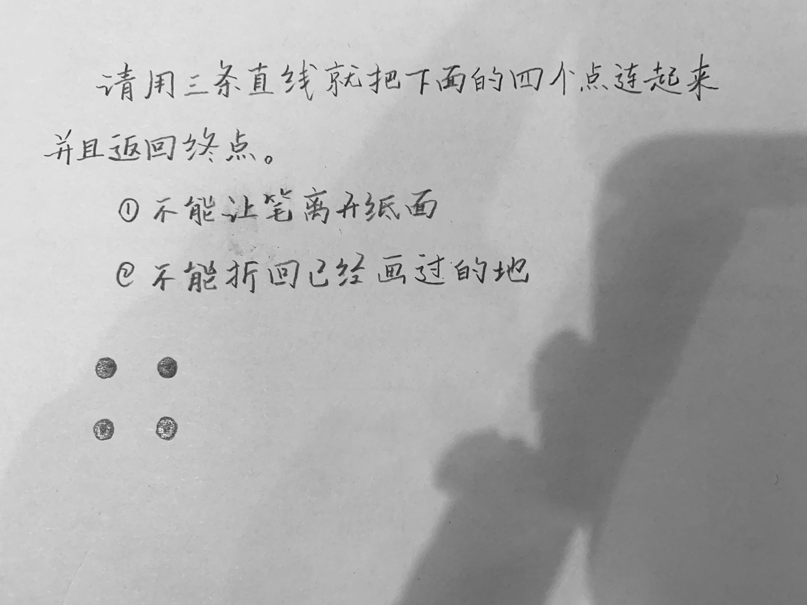

`答案`

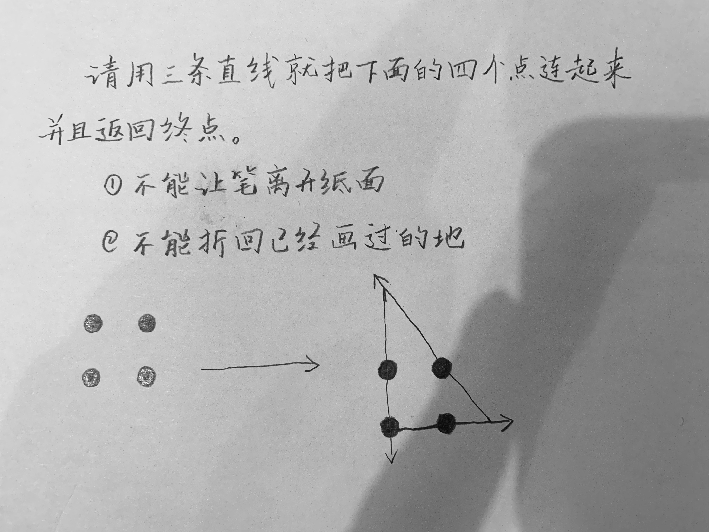

退一步， 问自己一下这些问题：

*  你是在设法解决真正的问题，还是被外围的技术问题转移了注意力？

*  这件事情为什么是一个问题？

*  是什么使它如此难以解决？

*  它必须以这种方式完成吗？

*  它真的必须完成吗？

### 第六章 当你编码时

`靠巧合编程` 

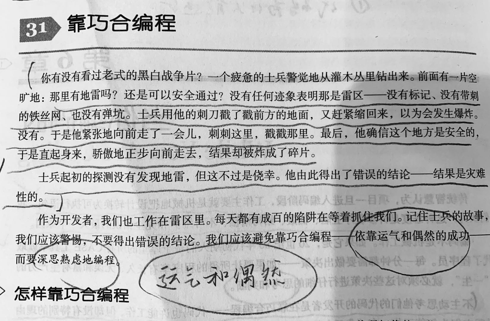

`靠巧合编程的经过` 
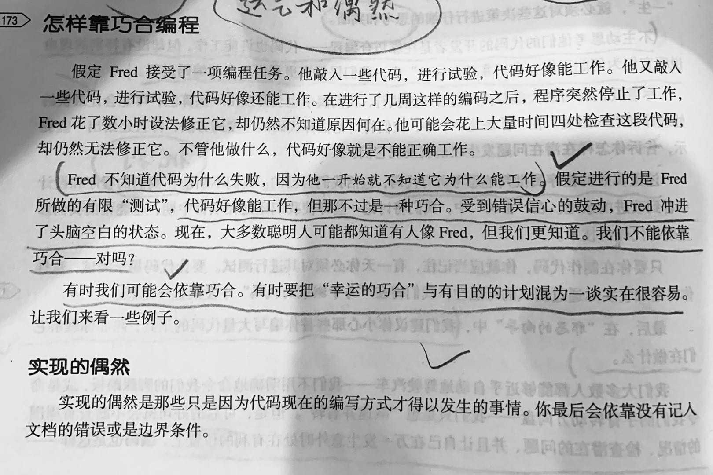
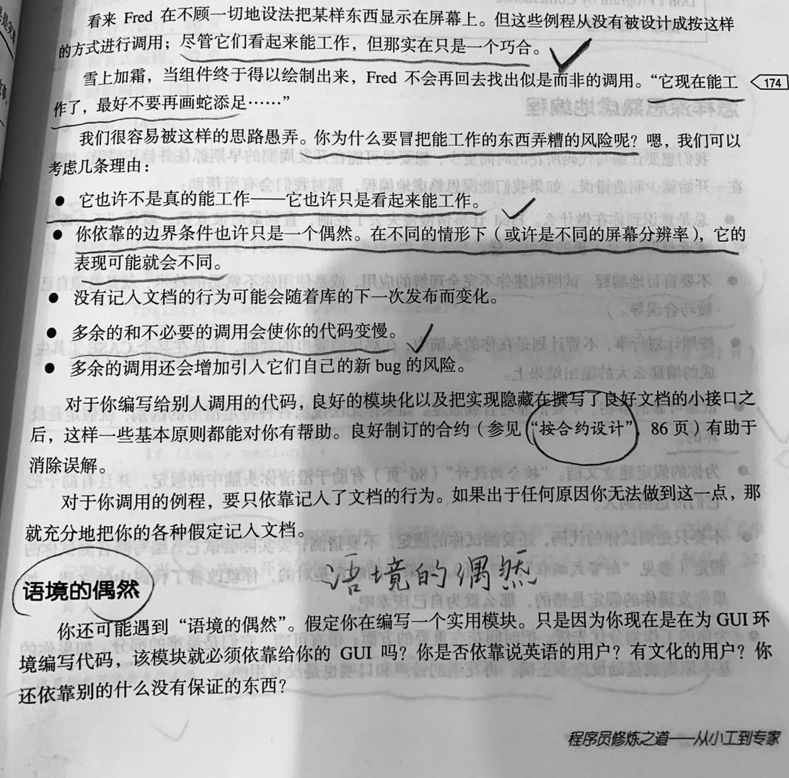

`深思熟虑的编程` 
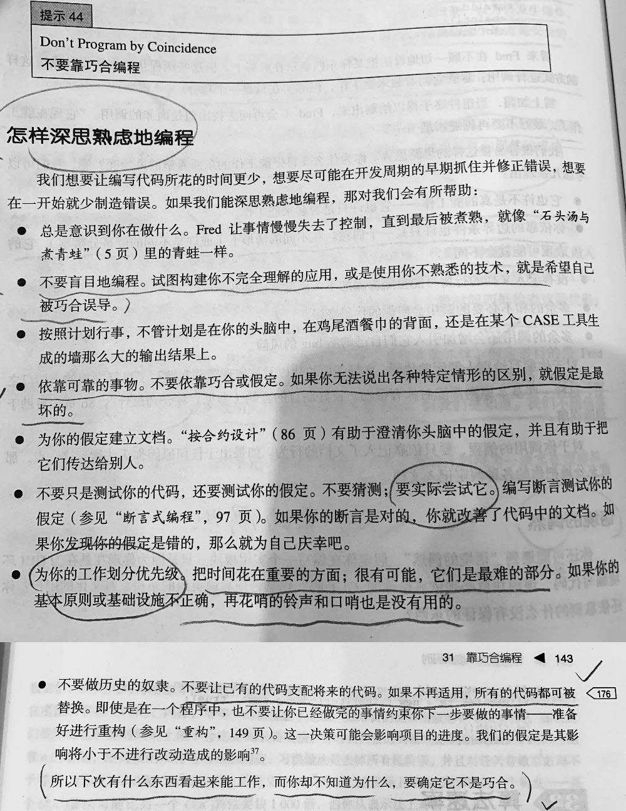

### 第五章 弯曲或曲折

`解耦与得墨忒耳法则` 

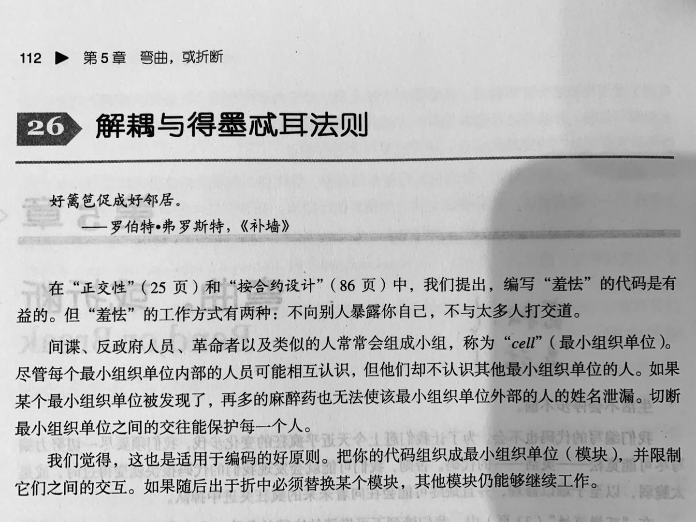

`时间的耦合` 

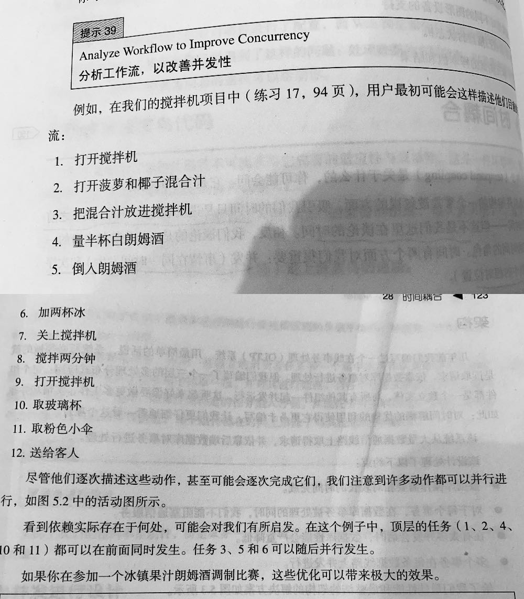
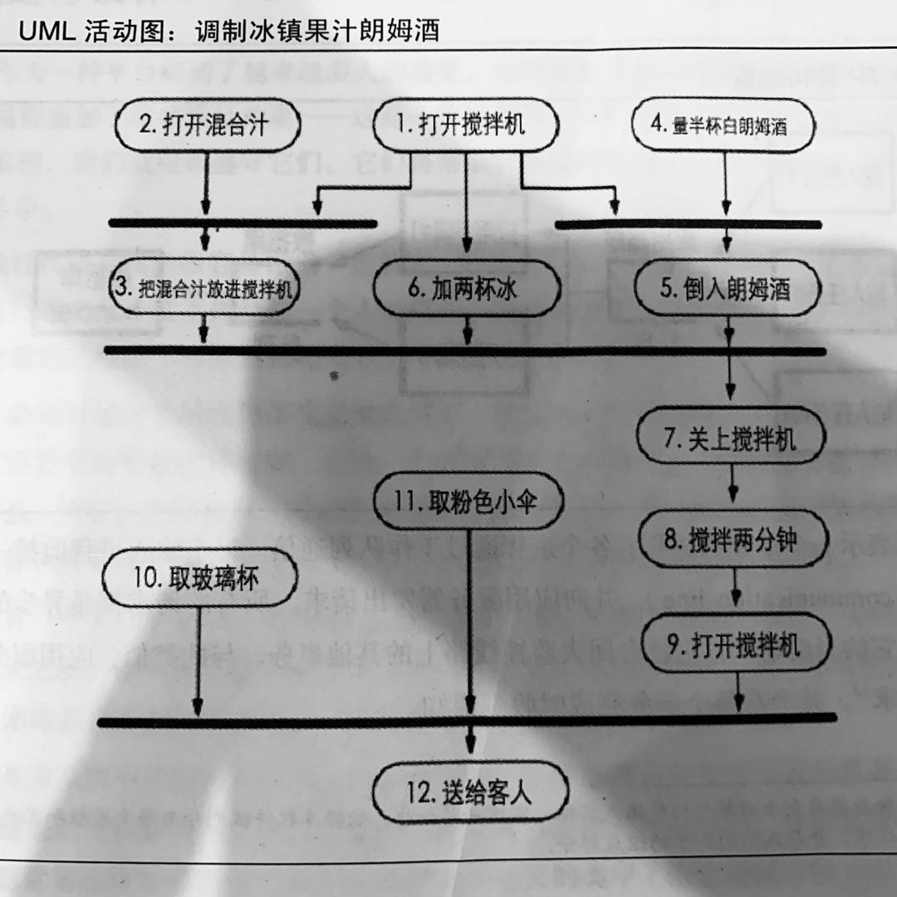

### 第一章 注重实效的哲学

`靠巧合编程的经过` 
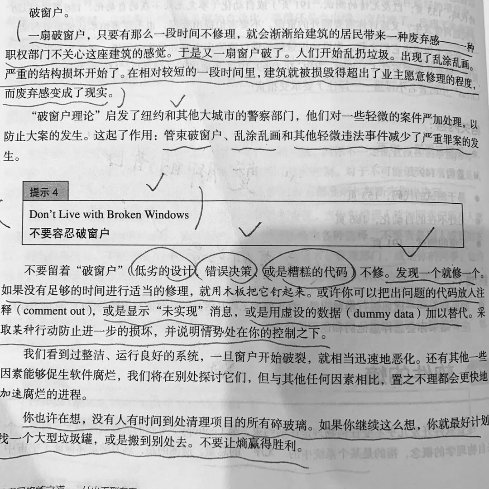
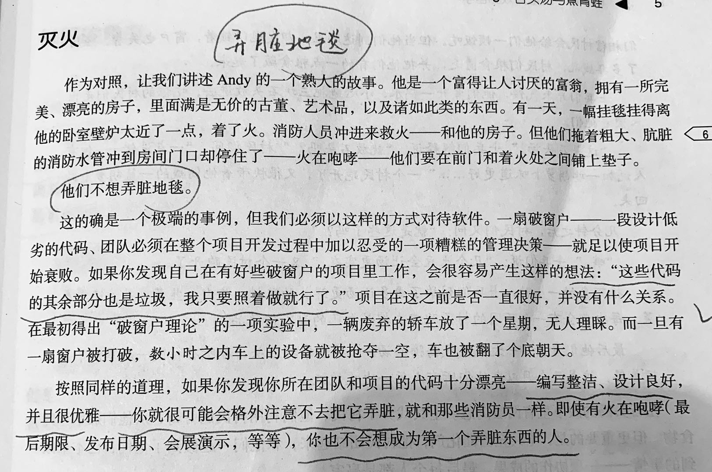

`深思熟虑的编程` 

### 第八章 注重实效的项目

`傲慢与偏见` 

`你愉悦我们已经足够长久。简·奥斯丁《傲慢雨偏见》`

::: Sign Your Work
在你的做作品上签名。
:::

`这是我编写的，我对自己的工作负责` 

`我编码，我负责！`

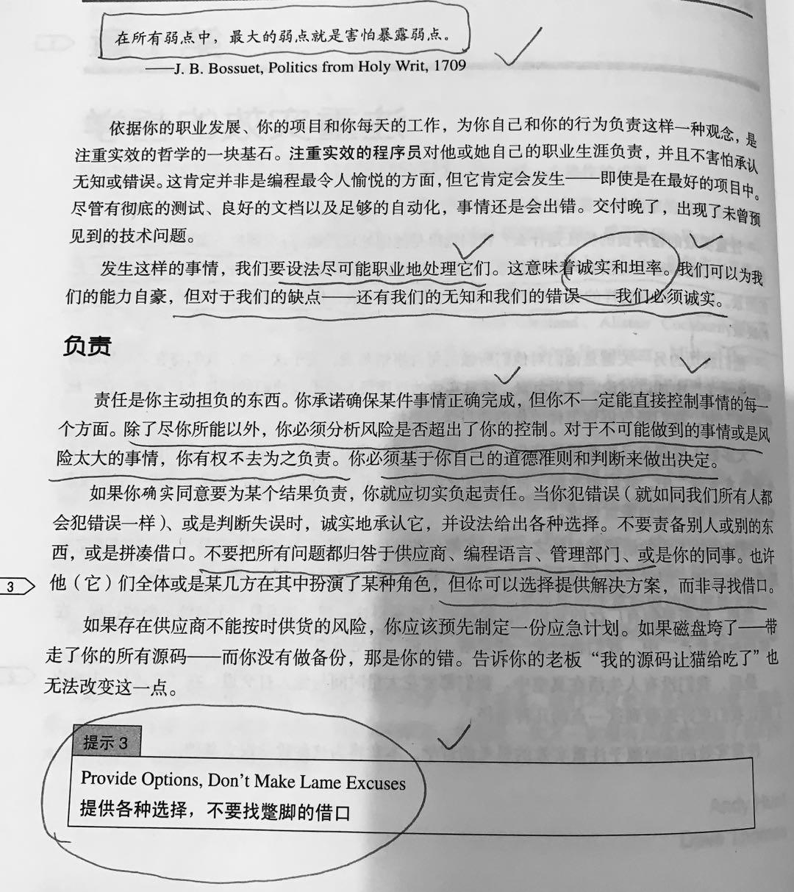

